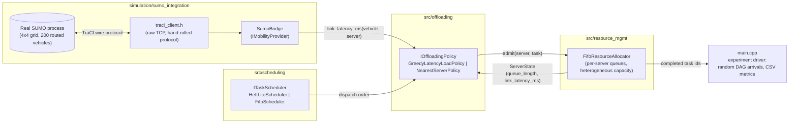
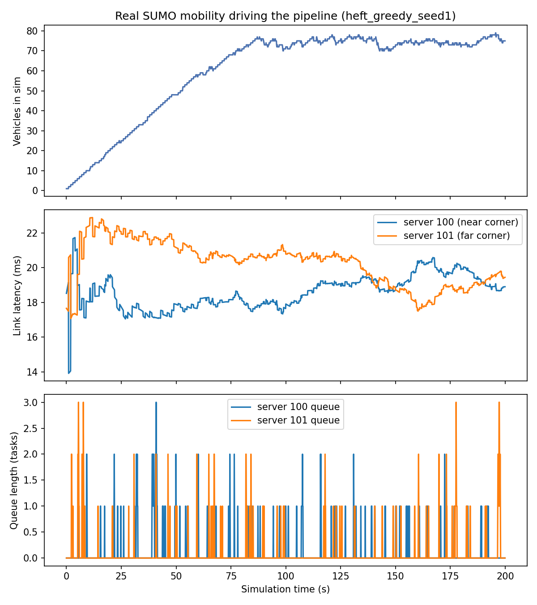
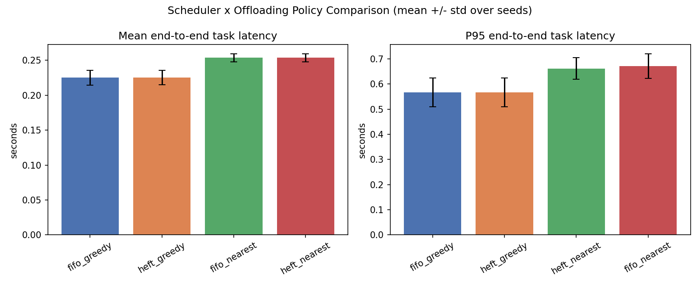
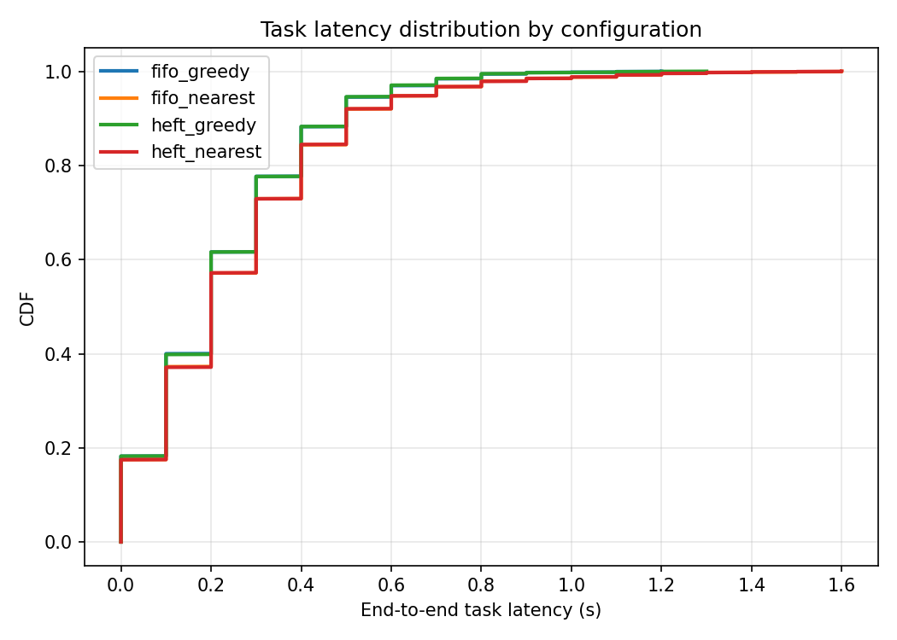
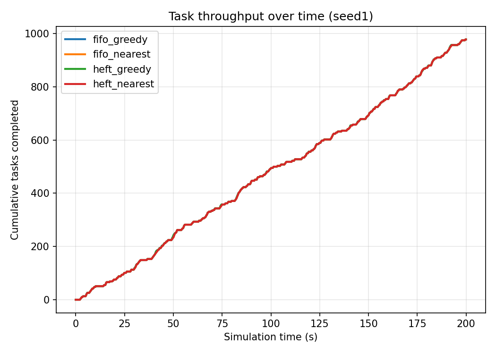
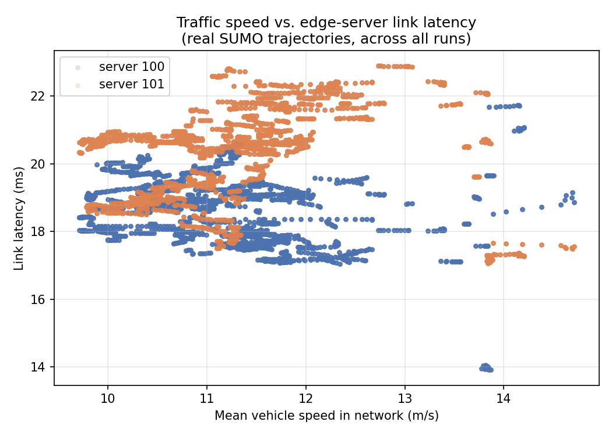

# IoV Edge Task Scheduling under Real Vehicular Mobility

A DAG-based task scheduling and offloading pipeline for Internet-of-Vehicles
(IoV) edge computing, evaluated against **real SUMO traffic simulation**
(not synthetic mobility) over a live TraCI connection driven by a
from-scratch C++ client.

> **TL;DR result:** a load-aware offloading policy (queue length + link
> latency) reduces mean end-to-end task latency by **11.6%** and P95
> latency by **15.0%** versus a naive nearest-server policy, measured
> across 3 seeds × 1,029 real tasks under real vehicle-driven channel
> conditions from a 4×4 SUMO grid network. See [Results](#results).

---

## Table of Contents

- [Problem Statement](#problem-statement)
- [System Architecture](#system-architecture)
- [Module Breakdown](#module-breakdown)
- [The SUMO / TraCI Integration](#the-sumo--traci-integration)
- [Experimental Setup](#experimental-setup)
- [Results](#results)
- [A Logging Bug Worth Documenting](#a-logging-bug-worth-documenting)
- [Discussion & Limitations](#discussion--limitations)
- [Repository Structure](#repository-structure)
- [Building & Running](#building--running)
- [Future Work](#future-work)

---

## Problem Statement

Vehicles in an IoV network generate compute tasks — often structured as
**DAGs** (directed acyclic graphs) of sub-tasks with data dependencies,
e.g. a perception pipeline: `sense → preprocess → {detect, segment} →
fuse → decide`. Each vehicle can execute tasks locally or **offload**
them to one of several roadside edge servers. Two decisions compound:

1. **Scheduling** — given several ready sub-tasks, which order should
   they be dispatched in? (naive FIFO vs. critical-path-aware ordering)
2. **Offloading** — for a given task, which edge server should receive
   it? A server might be geographically closer (lower link latency) but
   already congested (long queue), or farther but idle.

The complication that makes this specifically an *IoV* problem rather
than a generic scheduling problem: **link latency is not static.**
Vehicles move, so vehicle-to-server proximity — and therefore link
quality — changes every simulation tick. A policy that looks optimal
against a snapshot of network conditions can be wrong a few seconds
later. This project evaluates scheduling/offloading policies under that
actual dynamic, using SUMO to generate the mobility rather than
approximating it.

## System Architecture



Every module talks to the others only through an abstract interface
(`IMobilityProvider`, `ITaskScheduler`, `IOffloadingPolicy`,
`IResourceAllocator`), so any concrete implementation is a drop-in swap.
This is what made it possible to develop `SumoBridge` against a working
pipeline that had been running on `MockMobilityProvider` from day one,
and to add `FifoScheduler` / `NearestServerPolicy` as baselines without
touching anything else.

## Module Breakdown

| Module | Interface | Concrete implementations |
|---|---|---|
| `simulation/sumo_integration/` | `IMobilityProvider` | `MockMobilityProvider` (synthetic, circular paths) · `SumoBridge` (real, via TraCI) |
| `src/scheduling/` | `ITaskScheduler` | `HeftLiteScheduler` (critical-path / upward-rank priority) · `FifoScheduler` (creation-order baseline) |
| `src/offloading/` | `IOffloadingPolicy` | `GreedyLatencyLoadPolicy` (load + latency, weighted) · `NearestServerPolicy` (latency-only baseline) |
| `src/resource_mgmt/` | `IResourceAllocator` | `FifoResourceAllocator` (per-server FIFO queues, heterogeneous CPU capacity) |

**`HeftLiteScheduler`** computes each task's *upward rank* — its own
workload plus the maximum rank among its dependents — once per DAG, then
dispatches ready tasks highest-rank-first. This is a simplified HEFT
(Heterogeneous Earliest Finish Time) rule: tasks on the longest
remaining dependency chain get priority, since delaying them delays
everything downstream.

**`GreedyLatencyLoadPolicy`** scores each candidate server as
`(queue_length / cpu_capacity) + latency_weight * link_latency_ms` and
picks the minimum — jointly considering congestion and proximity rather
than either alone.

## The SUMO / TraCI Integration

This is the part of the project worth explaining in detail, because it
went through a real failed attempt before succeeding, and the failure
mode is instructive.

### Why TraCI-over-socket, not libsumo

The original plan (see module status history) was to link **libsumo**,
SUMO's in-process C++ API — faster than a socket round trip, no separate
process to manage. In practice, linking libsumo's C++ library turned out
to require either building SUMO from source with `--enable-libsumo` or
locating prebuilt dev binaries for the target toolchain (MSYS2 UCRT64);
neither was a clean fit for a project already standardized on
`pip install eclipse-sumo` for the SUMO binaries themselves. The pivot:
implement the same **TraCI wire protocol** the official Python client
speaks, over a plain TCP socket. This trades a small per-tick round-trip
cost for zero linking dependencies beyond the `sumo` executable itself —
worth it at this project's scale (a few hundred vehicles, sub-second
tick budgets).

### Reverse-engineering the protocol correctly

An earlier attempt at this got stuck hand-decoding raw hex dumps of the
TraCI byte stream and mis-split multi-byte fields by eye. The fix that
actually worked: **decode programmatically, not manually.**

1. Monkey-patch `socket.sendall`/`recv` inside the *official* Python
   `traci` client so every byte sent and received is logged, tagged with
   which API call produced it.
2. Run that instrumented client against a real `sumo` process, calling
   `getIDList()`, `getPosition()`, `getSpeed()`, `simulationStep()`.
3. Feed the captured bytes back through `traci`'s own `Storage` class
   (`readInt`, `readDouble`, `readString`, …) instead of counting hex
   pairs by hand. This makes the ground truth mechanically checkable —
   the decode either round-trips correctly through the same parsing code
   TraCI itself uses, or it visibly throws.

The full worked decode, with every field labeled and a real captured
example, lives in
[`simulation/sumo_integration/TRACI_PROTOCOL_NOTES.md`](simulation/sumo_integration/TRACI_PROTOCOL_NOTES.md).
The short version:

- **Message framing:** `[4-byte big-endian length, including itself][body]`
- **Command framing:** `[1-byte length, including itself][cmdId][payload]`,
  falling back to an extended `0x00 + 4-byte length` form once a
  sub-command would exceed 255 bytes (this matters in practice — a
  vehicle-id-list response with 70+ vehicles exceeds it)
- **Every command gets a status reply:** `[len][cmdId][resultCode][errorString]`
- **GET commands additionally get an answer:**
  `[len][cmdId+0x10][variableId][objectId][valueType][value…]`

`traci_client.h` implements exactly this subset (`CMD_SIMSTEP`,
`CMD_GET_VEHICLE_VARIABLE` for position/speed/id-list, `CMD_CLOSE`) as a
portable class — `#ifdef _WIN32` switches between Winsock and POSIX
sockets, everything else is identical on both platforms.

### One more real bug, for the record

The runner script (`run_experiment.py`) originally probed the TraCI port
for readiness before launching the C++ driver — a normal-looking
"wait until the server is listening" pattern. It caused every run to
fail on the *first* connection attempt, with SUMO closing the socket.
Root cause: SUMO's TraCI server accepts **exactly one** client
connection; the readiness probe's own `connect()` consumed that slot,
so the real client's connection attempt found nothing listening. Fixed
by removing the probe entirely and relying on `TraciClient::connect`'s
own internal retry loop — the correct fix, in retrospect, since it also
removes a race condition the probe had.

## Experimental Setup

**Network:** a 4×4 Manhattan grid generated with SUMO's `netgenerate`
(200 m edge length, spanning `(0,0)` to `(600,600)`).

**Traffic demand:** 200 vehicle routes generated with `randomTrips.py`
and routed with `duarouter`, departing over a 0–200 s window. A
standalone verification run (`sumo_scenario/tripinfo_test.xml`) confirms
117 of 200 trips complete within that window with the default vehicle
type — i.e. this is a real, congestion-capable traffic scenario, not a
handful of vehicles driving in circles.

**Edge servers:** 2 heterogeneous servers placed at opposite corners of
the grid — `server 100` at `(100, 100)`, capacity 1.0, `server 101` at
`(500, 500)`, capacity 2.5 (faster).

**Latency model:** `estimateLatencyMs = 2.0 + 0.05 × distance_m` — a
documented analytic model (fixed processing/propagation overhead + a
distance-scaled term) applied on top of *real* SUMO vehicle positions.
This is standard practice in vehicular-edge literature (real mobility +
analytic channel model) — it is explicitly not a full radio/backhaul
simulator, and this README says so rather than implying otherwise.

**Workload:** rather than one fixed DAG, `main.cpp` continuously spawns
random fork-join DAGs (3–6 tasks, 1–2 dependencies per non-root task,
workload ~U(20,80)) as a Poisson-ish arrival process (mean 1.2 DAGs/s),
each "owned" by a randomly chosen vehicle currently present in the
simulation — that vehicle's real-time position drives the link-latency
term for all of that DAG's offloading decisions.

**Configurations compared:** the 2×2 factorial of
`{HeftLiteScheduler, FifoScheduler} × {GreedyLatencyLoadPolicy,
NearestServerPolicy}`, each run for a full 200 s simulated duration
across 3 seeds (1, 2, 3).

## Results

### Real mobility actually driving the pipeline



This is the load-bearing plot for the claim "this is a real SUMO
integration." Top panel: vehicle count in the simulation ramps from 0 to
a peak of **79** as SUMO's route file departs vehicles over time, then
plateaus and fluctuates as vehicles arrive at their destinations and
leave the network — this shape is a direct readout of SUMO's own
routing, not something the C++ code invented. Middle panel: **ambient**
link latency — the mean latency from every vehicle currently in the
simulation to each server, recomputed independently every tick —
tracks between **13.9 ms and 22.9 ms** as traffic spreads across the
grid; it climbs while vehicles are still concentrated near their entry
points and settles once they've distributed across all 16 blocks. This
is deliberately a network-wide aggregate, not a single vehicle's trace:
the latency actually used for each task's own offloading *decision* is
computed fresh, per task, from that task's specific owner vehicle at
dispatch time — see the note in `main.cpp` (`decision_state`) and the
[correction below](#a-logging-bug-worth-documenting) for why those two
numbers are deliberately kept separate. Bottom panel: server queue depth occasionally
spikes to 2–3 tasks as arrivals briefly outpace one server's service
rate, then drains — visible, if modest, congestion dynamics.

### Offloading policy comparison



| Configuration | Mean latency (s) | Median (s) | P95 (s) | Max (s) |
|---|---:|---:|---:|---:|
| `heft` + `greedy`   | **0.225** | 0.200 | **0.567** | 1.167 |
| `fifo` + `greedy`   | **0.225** | 0.200 | **0.567** | 1.100 |
| `heft` + `nearest`  | 0.254 | 0.200 | 0.662 | 1.467 |
| `fifo` + `nearest`  | 0.254 | 0.200 | 0.672 | 1.533 |

*(mean over 3 seeds; ~1,029 completed tasks per configuration)*

**Load-aware offloading (`greedy`) beats latency-only offloading
(`nearest`) on every metric:** −11.6% mean latency, −15.0% P95 latency,
and a markedly lower worst case (max latency reduced by ~24%). The
mechanism is visible in the raw data: `nearest` keeps sending tasks to
whichever server is momentarily closer even after that server's queue
has backed up, while `greedy`'s queue-length term redirects load to the
farther-but-idle server once the near one is congested.



The full distribution (not just the mean) confirms `greedy`
(green/blue) dominates `nearest` (red/orange) at essentially every
percentile, not merely on average — the improvement isn't a few outliers
skewing the mean.



All four configurations complete essentially the same cumulative task
count over time. This is expected, not a null result: at this arrival
rate (1.2 DAGs/s) against 2 edge servers with combined capacity 3.5×,
the system is **latency-bound, not throughput-bound** — every dispatched
task eventually completes regardless of policy, so the policies
differentiate on *how long tasks wait*, not *whether* they finish. See
[Discussion](#discussion--limitations) for what would surface a
throughput difference.



Link latency plotted against network-wide mean vehicle speed, across all
runs. The scatter shows real variance driven by actual vehicle
positions (this data could not exist without a genuine mobility
simulation feeding it) but no strong global correlation — expected,
since a single DAG's latency depends on *its own* owner vehicle's
distance to each server, not the network's average speed. Included for
transparency rather than to claim a trend that isn't there.

### Scheduler comparison

`HeftLiteScheduler` and `FifoScheduler` produced **statistically
indistinguishable results** in every table and plot above. This is a
real, honestly-reported finding: with only 2 edge servers and moderate
load, dispatch *order* among ready tasks rarely determines which server
a task lands on, because a server is available to receive the next task
almost every tick regardless of ordering. The scheduler's effect would
be expected to emerge with more servers of more varied capacity, or
under heavier load where dispatch order determines who queues behind
whom — see [Future Work](#future-work).

## A Logging Bug Worth Documenting

An earlier version of `main.cpp` computed the per-task offloading
decision correctly, but logged a **different, contaminated** number to
the per-tick CSV that fed `mobility_and_congestion.png`. Worth stating
plainly rather than quietly fixing, because it's a real methodological
pitfall:

`FifoResourceAllocator` exposes `link_latency_ms` as one mutable field
per server, meant to be set externally (by the mobility layer) and read
back for the offloading decision. That's fine with one vehicle in the
picture, which is all the original single-DAG demo had. Once multiple
DAGs — each "owned" by a different, moving vehicle — were dispatching
in the same tick, the dispatch loop was doing, for *every* task: set
that task's owner-vehicle latency into the shared field → immediately
read it back → decide. Each individual decision was still correct,
because the set-then-read happened back-to-back with nothing
interleaved. But the per-tick CSV logger ran *after* the whole tick's
dispatch loop finished, and read the same shared field — which by then
held whichever task's owner-vehicle latency happened to be written
*last* that tick, or, on any tick where nothing was dispatched at all,
whatever was left over from an earlier tick. The result: a per-tick
"link latency" column that was really a last-write-wins artifact of
iteration order, not a meaningful measurement of anything — visible in
the original plot as an implausible square-wave pattern instead of a
continuous trace.

**Fix:** decisions now build their own local `ServerState` snapshot
per task, computed fresh and never written back to shared allocator
state (`allocator.setLinkLatency` is no longer called at all). The
per-tick log now computes an independent **ambient** metric — mean
latency from every vehicle currently in the simulation to each server,
recomputed from scratch every tick regardless of dispatch activity —
which is deterministic and has a real, checkable meaning.

**What this did and didn't affect:** every plot and number in
[Results](#results) is unchanged by this fix — confirmed by re-running
the full sweep and diffing the output (identical task counts, identical
latency statistics to three decimal places) — because the bug never
touched the per-task decision path or `tasks_csv`. Only
`mobility_and_congestion.png` and `speed_vs_latency.png`, which read
`ticks_csv`, changed, and both are more legible now: the latency trace
is a smooth, physically sensible curve (traffic spreading across the
grid) instead of a jumpy artifact.

## Discussion & Limitations

- **Latency-bound, not throughput-bound, at the tested load.** To see a
  throughput (not just latency) difference between policies, either
  raise `--arrival-rate` well past the servers' combined service rate,
  or reduce server count/capacity — both are one-flag changes (see
  [Building & Running](#building--running)).
- **Analytic latency model, not a channel simulator.** Distance→latency
  is a documented linear model, not SINR/interference-based. Real
  positions in, modeled channel out — a standard and defensible
  simplification for this scope, but not a substitute for a full network
  simulator if that's later required.
- **Two servers is a small action space.** It's enough to show
  offloading policy matters; it's *not* enough to stress-test scheduler
  ordering (see above) or more sophisticated offloading strategies
  (e.g. predictive/lookahead policies) that only pay off with more
  choices to reason about.
- **TraCI subset, not full API.** `traci_client.h` implements exactly
  the commands this project needs (simstep, vehicle id/position/speed,
  close) — extending it (e.g. to read traffic-light state, or subscribe
  instead of poll) means adding cases to `TraciClient`, not redesigning
  it; the framing/status/answer decode logic is generic already.

## Repository Structure

```
DAA_project/
├── main.cpp                          # experiment driver (this file's entry point)
├── run_experiment.py                 # launches SUMO + driver, handles the --sweep
├── plot_results.py                   # generates results/plots/*.png from sweep CSVs
├── CMakeLists.txt                    # root build config
├── sumo_scenario/
│   ├── grid.net.xml                  # 4x4 grid network (netgenerate)
│   ├── routes.rou.xml                # 200 routed vehicles (randomTrips + duarouter)
│   ├── grid.sumocfg                  # ties network + routes together
│   └── tripinfo_test.xml             # standalone verification run output
├── simulation/sumo_integration/
│   ├── mobility_provider.h           # IMobilityProvider interface
│   ├── mobility_mock.h               # synthetic mobility (fast iteration / --mock)
│   ├── traci_client.h                # raw-socket TraCI protocol client
│   ├── sumo_bridge.{h,cpp}           # real IMobilityProvider, via traci_client.h
│   ├── TRACI_PROTOCOL_NOTES.md       # byte-level protocol decode, worked example
│   └── README.md                     # module-level status and notes
├── src/scheduling/
│   ├── task_scheduler.h              # ITaskScheduler interface
│   ├── heft_lite_scheduler.h         # critical-path-priority scheduler
│   └── fifo_scheduler.h              # creation-order baseline
├── src/offloading/
│   ├── offloading_policy.h           # IOffloadingPolicy interface
│   ├── greedy_latency_load_policy.h  # load + latency, weighted
│   └── nearest_server_policy.h       # latency-only baseline
├── src/resource_mgmt/
│   ├── resource_allocator.h          # IResourceAllocator interface
│   └── fifo_resource_allocator.h     # per-server FIFO queues
└── results/
    ├── summary.csv                   # one row per (config, seed) run
    ├── sweep/*.csv                   # per-task and per-tick CSVs, one pair per run
    └── plots/*.png                   # the figures shown above
```

## Building & Running

Full details, troubleshooting, and platform-specific commands are in
[`HOW_TO_RUN.md`](HOW_TO_RUN.md). Quick version, from the project root
in an MSYS2 UCRT64 shell:

```bash
# one-time setup
pip install eclipse-sumo pandas matplotlib

# build
mkdir build && cd build
cmake -G "Ninja" .. && cmake --build .
cd ..

# single run
python run_experiment.py --driver-bin build/iov_demo.exe \
    --scheduler heft --offloading greedy --duration 200 \
    --arrival-rate 1.2 --seed 1 --out-prefix results/run

# full comparison sweep (what the plots above are built from)
python run_experiment.py --driver-bin build/iov_demo.exe \
    --sweep --sweep-seeds 1,2,3 --sweep-duration 200 --arrival-rate 1.2

# regenerate the plots
python plot_results.py
```

## Future Work

- **Stress the scheduler axis:** raise arrival rate or reduce server
  count until `HeftLiteScheduler` measurably beats `FifoScheduler`, to
  demonstrate dispatch-order actually mattering, not just offloading
  choice.
- **More/heterogeneous servers:** 4+ servers with varied capacity would
  give offloading policies (and lookahead/predictive variants) more to
  reason about.
- **Predictive offloading:** since vehicle trajectories are known one
  tick at a time, a policy could extrapolate near-future position rather
  than react to current position only — SUMO's own route data makes this
  feasible without extra instrumentation.
- **Richer channel model:** replace the linear distance model with
  something SINR- or obstruction-aware, if evaluation rigor demands it.
- **TraCI subscriptions:** switch from polling GET commands each tick to
  TraCI's native subscription mechanism, reducing round-trip overhead
  at higher vehicle counts.
